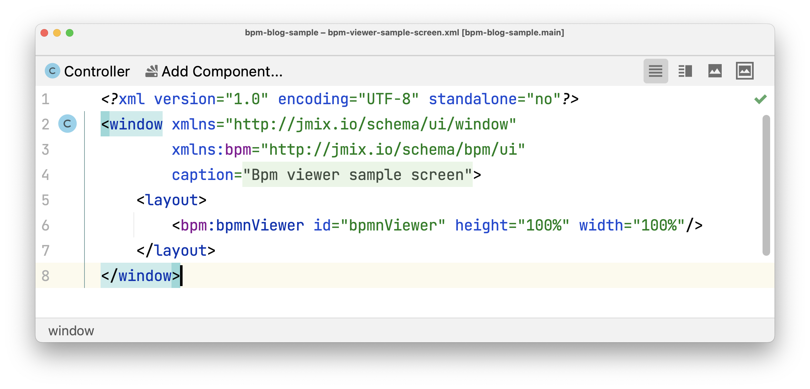

# Boosting BPA development with a high-productivity platform

At [Haulmont](https://haulmont.tech/?utm_source=bpmn&utm_medium=referral&utm_campaign=bpnmio-article), we’re focused on developing tools and platforms that enhance developers’ productivity by automating coding routines and bringing ready-to-use application components into a single development environment — IntelliJ IDEA. Established in 2008 as a custom development software house, we understand what productivity means for technical leaders. When time and resources are limited, selecting the right tools for the job and capitalising on framework strengths rather than fighting against them is essential. This led to the creation of a high-productivity platform for Java enterprise applications. In 2016 our team introduced the CUBA Platform as open-source, and in 2020, we released the CUBA Platform successor — [Jmix](http://jmix.io/?utm_source=bpmn&utm_medium=referral&utm_campaign=bpnmio-article).

Currently, [Jmix](http://jmix.io/?utm_source=bpmn&utm_medium=referral&utm_campaign=bpnmio-article) is positioned as an open-source high-productivity platform for building enterprise-grade applications. Java developers worldwide use Jmix to expedite the development of various data-centric, business-process automation, and content management applications, especially when faced with strict time and budget constraints. The most beneficial feature of Jmix is that it enables a single Java developer to become a full-stack developer, delivering a standard Spring Boot application at the end. With no runtime fees, a single language (Java/Kotlin) for the backend and UI, only mainstream core technologies, an IntelliJ IDEA, and a developer-friendly professional IDE, Jmix appeals to developers. Technology interoperability with the IDE ecosystem and the open-source core enabled acquiring a solid community around the technology with over 25 000 developers worldwide.

## First steps with BPMN in the CUBA Platform

Data-centric and content management applications often require business process automation functionality to separate transactional business logic from the code. This can be done with an embedded workflow modeler allowing analysts and developers to design business logic following BPMN standards. We came to this in 2017 when we began receiving requests from our community. Initially, we provided a custom business process design tool powered by Activiti.

This is how the BPMN modeler looked like in the CUBA Platform.

We provided this modeler as a part of the Business Process Management add-on, which included the following features:

- Integrated runtime BPMN visual designer;
- Integrated data model — Activiti data model wrapped in CUBA entities, enabling developers to use them in UI and business logic easily;
- Process forms — a convenient way to display process assignments and actions;
- UI for managing process models, running process instances, and assignments;
- Sub-processes — existing process models can be incorporated into a larger process model;
- Localization.

The BPMN modeler stored business processes internally in a specific JSON format. When the developer launched the process deployment CUBA automatically converted it to BPMN XML format for use by the Activiti BPM engine. This marked the initial introduction of an integrated environment for designing processes in BPMN, enhancing process context with data model objects and business-specific process forms, and executing them. While CUBA community members started adopting the feature in real projects, the platform team found the CUBA BPM add-on limited in potential extensions. By the end of 2018, it also became clear that the UI of the BPMN modeler was outdated.

## BPMN revisited in Jmix

In 2019, we began designing the next generation of the CUBA Platform — Jmix. There were two main ideas for the next generation:

- Reduce custom technology implementations and align more closely with mainstream Java application development approaches;
- Consolidate maximum productivity tools into a single development environment, eliminating the need to switch between different windows and keeping everything needed right under the developer’s fingertips.

We significantly emphasised the principle – «Don’t reinvent the wheel». Consequently, integrating a modern BPMN modeler with minimal customisations became essential. After a series of internal R&D efforts, we concluded that bpmn.js was the winner, given its list of features:

- Modern appearance;
- Extensive capabilities for enhancements, such as new elements and styles;
- A wealth of real use-case implementation examples on GitHub;
- Support from a free community forum that features intensive discussions;
- Rapid evolution.

As for the BPM engine, the choice was quite clear. The technical experts from Activiti we had been in contact with transitioned to a new project — Flowable BPM. As a result, it was only natural for us to move from Activiti to Flowable, maintaining the same support team and core BPM technology.

First, we implemented a bpmn.js modeler in the runtime of Jmix applications to support the feature initially introduced in CUBA. The new appearance of the BPMN designer was impressive.

A new look of BPMN designer in Jmix runtime.

Here, I want to delve deeper into the details of BPMN modeler implementation. As mentioned, one of the key Jmix features is that developers use a single language to build both the application’s front- and backend. This feature is supported by a server-side Vaadin technology within the Jmix framework. Vaadin enables manipulation of front-end layout via Java APIs. The Jmix platform dev team primarily consists of professional Java developers. Consequently, we decided to wrap the bpmn-js modeler into a Vaadin UI component and interconnect specific Java methods with the js-modeler functions. As a result, Jmix developers received a ready-to-use Java component, which can be seamlessly integrated into the application according to the business task requirements.

As an example of this implementation, you can examine the Java component used to monitor the current state of a process. Out-of-the-box, Jmix provides a BPM subsystem in application runtime and allows monitoring of the process state in the process instance editor screen, as illustrated in the following screenshot.

A process instance editor with the state monitoring diagram.

In Jmix, developers can easily reuse the bpmnViewer component and add it to the custom screen on demand with just a few simple steps. First, you should add the bpmnViewer component to the Jmix screen layout descriptor as a standard UI component.

Jmix screen layout descriptor with the bpmnViewer component.

Second, the bpmnViewer must be injected into the custom screen controller, and the behavior should be specified according to the application's business logic.

Jmix screen controller demonstrating bpmnViewer initialization.

Item description:

1. Inject bmpnViewer component;
2. Set BPMN XML into the viewer component
3. Call the addMaker function to set the specific style

Once completed, it operates seamlessly on your custom screen. Incredibly quickly, with minimum coding efforts, Jmix developers can reuse bpmn-js capabilities throughout the entire project.

This is an example of how the integration of bmpn-js with Vaadin technology has brought new ideas to the application development process. However, we didn’t just wrap up the existing functionality of the bpmn-js modeler - we also extended it with some Jmix-specific features. To name a few:

- The service task configuration tool window offers a set of fields enabling the setup of a project’s Spring Bean, thereby eliminating potential naming errors and typos;
- Developers can manage Execution Listeners using a convenient list view and editor dialogs.

A Service task tool window extended with details enabling Spring Bean set up

An Execution Listeners tool window with a dedicated configuration dialog.

The integration of the bpmn-js modeler and Flowable BPM engine has allowed developers and analysts to design business processes visually and seamlessly connect them with the data model, application roles, and business logic. This appeared modern and valuable, but it didn’t match the core product idea – the developer still needed to switch between design time and runtime when creating a business process. Our goal was to introduce an experience where a developer can do almost the same as in runtime but without switching between different tools. Sounds awesome? In reality, it looks even better.

## Moving to a single BPM development environment

Jmix Studio plugin for IntelliJ IDEA with an integrated BPMN modeler.

This vision became a reality in 2021 when we integrated bpmn.js into the IntelliJ IDEA environment. We maintained the same application development lifecycle – once a process is designed in Jmix Studio, the developer runs it in the application using the embedded Flowable BPM engine on their local environment. The most challenging aspect was transferring the existing user experience from the previously designed BPMN modeler in runtime to IntelliJ IDEA. Our focus was on keeping a similar experience for the Jmix community while ensuring it was native to IDE tooling design guidelines. Embedding the BPMN modeler canvas was not particularly difficult; in contrast, creating an IDE native process parameters property editor tool window proved to be more challenging. After some internal R&D, the team decided to implement special highlighting of the edited property items in the IDE tool window, preserving the logical grouping of properties as it was in runtime. You can see the similarities by comparing the same User Task tool window in the Jmix runtime modeler and the Jmix Studio modeler.

We implemented a hierarchy tree structure, allowing developers to identify a set of property items and values related to a group of properties, with the group serving as the header node of the tree. We also designed a special background for property values to improve the developer experience, particularly for those using the IDE dark theme.

Components of the tool window properties table are often applicable for different types of Tasks or have similar purposes. Leveraging Kotlin DSL capabilities greatly benefited us in building this feature, making our codebase short and easy to modify.

## An Impact on developer productivity

Here, you might ask – ok, that’s nice, but how does it impact developer productivity? Here is the list of advantages it provides to developers and analysts:

- You can upload BPMN diagrams prepared by an analyst directly into IntelliJ IDEA and then enrich them with project-specific business logic, user screens, integrations, and exception handling without the need to switch to one another tool;
- You can deploy and run it on the developer’s workstation and test its business logic to ensure it runs as intended. Here you get access to all of IntelliJ's powerful debugging tools to streamline the process and make it more efficient;
- When finished with local debugging, you can commit and push the changes into the shared repository, allowing the analyst to see the updated version of the BPMN diagram and check the live version of the diagram within the application running in the test environment;
- If the analyst needs to change the BPMN model, the diagram can be adjusted in the application runtime using the same tool and tested again. After successful testing, the updated diagram version can be downloaded and sent back to the developer for implementation of the changes.

Thus, with Jmix, teams can cover the entire business process development lifecycle within the known tools, and what’s more, it can be integrated within CI/CD pipelines. In real projects, developers add dashboards to implement various process analytics and acquire statistics. This approach is quite similar to a BPMS solution that is tailored to a data-centric application and business logic in Java or Kotlin. Thanks to the bpmn.io project, developers can address diverse use cases with the same easy-to-use and widely applicable tooling.